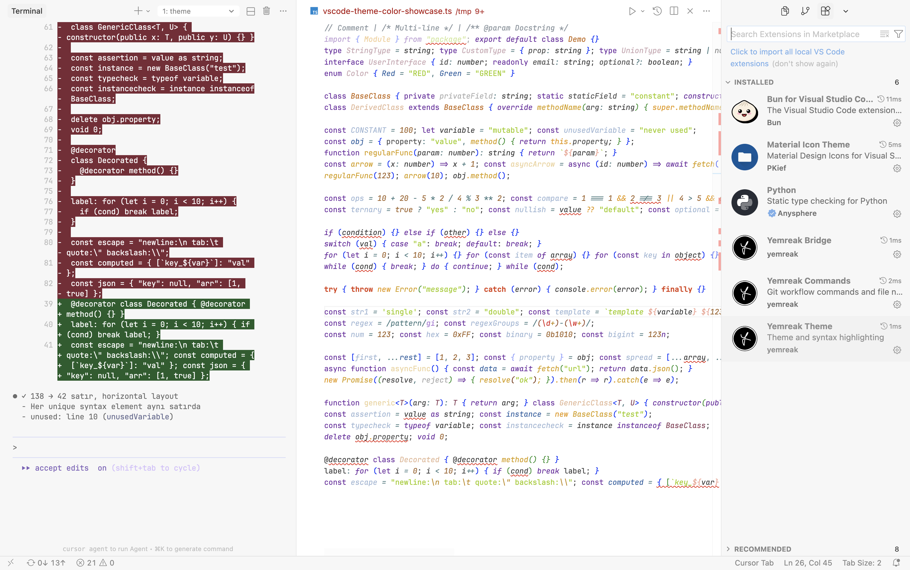

# Yemreak Theme

VSCode theme with dark/light variants and markdown syntax highlighting.

## Features

- **Dark theme**: High contrast with orange accents
- **Light theme**: Clean and subtle highlighting
- **Markdown support**: Optimized syntax highlighting for markdown

## Installation

Install from [Open VSX Registry](https://open-vsx.org/extension/yemreak/yemreak-theme)

## Dark Theme

High contrast with warm orange (#E09440) accents

## Light Theme

Clean with cool blue (#5C9FE8) accents

## License

Apache-2.0
